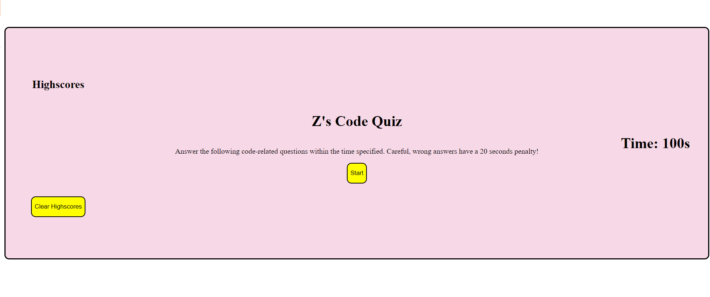
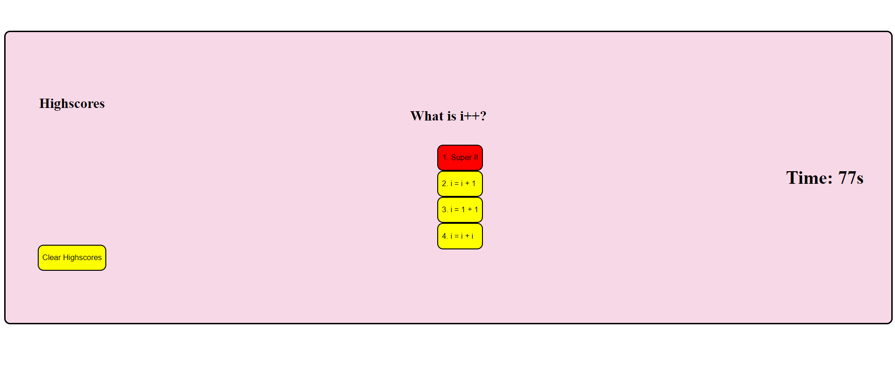
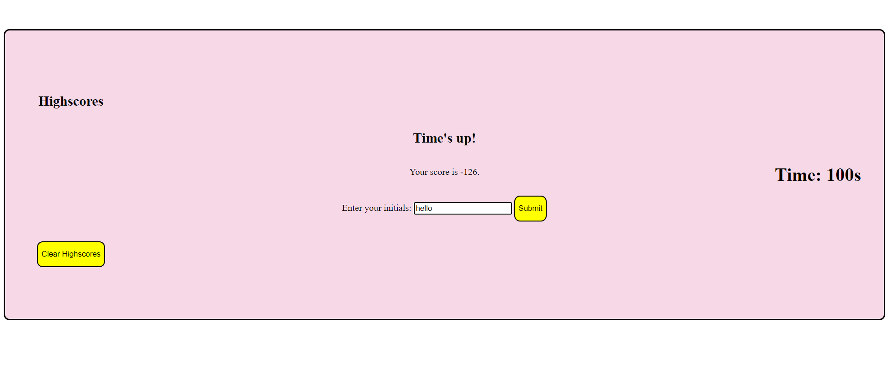
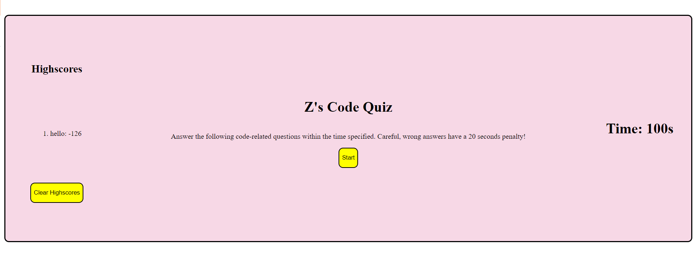

# Z's Code Quiz

## Description

I created a coding quiz website to strengthen my knowledge of JavaScript functions and syntax. I learned a lot in regards to making a page dynamic!

Here's a link to try it out: 

## Installation

N/A

## Usage

Click on the start button to start the timer and begin taking the coding quiz!
If you click on the wrong answer, you get time deducted. If you click on the wrong or right answer, the button changes color accordingly. Once the timer is up, or the questions end, you see your final score and get to save your initials into a local highscore list.

## License

MIT License

Copyright (c) 2023 zeinahares

Permission is hereby granted, free of charge, to any person obtaining a copy of this software and associated documentation files (the "Software"), to deal in the Software without restriction, including without limitation the rights to use, copy, modify, merge, publish, distribute, sublicense, and/or sell copies of the Software, and to permit persons to whom the Software is furnished to do so, subject to the following conditions:

The above copyright notice and this permission notice shall be included in all copies or substantial portions of the Software.

THE SOFTWARE IS PROVIDED "AS IS", WITHOUT WARRANTY OF ANY KIND, EXPRESS OR IMPLIED, INCLUDING BUT NOT LIMITED TO THE WARRANTIES OF MERCHANTABILITY, FITNESS FOR A PARTICULAR PURPOSE AND NONINFRINGEMENT. IN NO EVENT SHALL THE AUTHORS OR COPYRIGHT HOLDERS BE LIABLE FOR ANY CLAIM, DAMAGES OR OTHER LIABILITY, WHETHER IN AN ACTION OF CONTRACT, TORT OR OTHERWISE, ARISING FROM, OUT OF OR IN CONNECTION WITH THE SOFTWARE OR THE USE OR OTHER DEALINGS IN THE SOFTWARE.